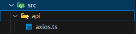

# Exemplo de Paginação
# Guia
1. Sobre
2. Como Executar o Projeto
3. Tecnologias
4. Ilustração

# Sobre
Olá, Dev! Este projeto é um exemplo de paginação desenvolvido em React. O foco principal é a implementação da funcionalidade de paginação, que foi integrada a uma API de listagem de produtos.

# Como Executar o Projeto
## Clone este repositório

```bash
git clone https://github.com/IanoMaciel/exemple-paginate.git
```

## Instale as depedências e execute o projeto

```bash
# 1. entre no diretório do projeto
cd exemple-paginate 

# 2. instale as depedências do projeto
yarn install #ou npm install

# 3. por fim, execute o projeto.
yarn dev #ou npm dev
```

## Sobre a API

> IMPORTANTE: A API utilizada neste projeto é de uso pessoal e, portanto, não será disponibilizada publicamente para execução. No entanto, incluí um exemplo do código da API desenvolvido em Laravel para referência nesta seção.

### Exemplo do Código Backend

O código abaixo apresenta dois métodos. O método `construtor` é responsável pela injeção de dependências, um padrão de design que pode ser opcional e depende da definição do time de desenvolvimento. Esse padrão permite que os objetos recebam suas dependências em vez de criá-las internamente. No Laravel, por convenção, a listagem é realizada por meio do método `index`, conforme mostrado no código abaixo.

```php
<?php

namespace App\Http\Controllers;

use App\Models\Product;
use Illuminate\Http\Request;

class ProductController extends Controller {
   protected $product;

   public function __construct(Product $product) {
      $this->product = $product;
   }

   /**
   * @param Request $request
   * @return \Illuminate\Http\JsonResponse
   */
   public function index(Request $request): \Illuminate\Http\JsonResponse {
      $query = $this->product->query();

      // filtro
      if ($request->has('search')) {
         $search = $request->get('search');
         $query->where('name', 'like', '%' . $search . '%');
      }
      
      // paginação
      $per_page = $request->get('per_page', 10);
      $products = $query->paginate($per_page);

      return response()->json($products, 200);
   }
}
```

### Modificações do Projeto Frontend

No diretório `src/api`, abra o arquivo `axios.ts` e modifique o valor de `baseURL` para o endereço da sua API.



```typescript
import axios from 'axios';

const api = axios.create({
    baseURL: 'http://127.0.0.1:8000/api/',
    withCredentials: true
})

export default api;
```

# Ilustração


